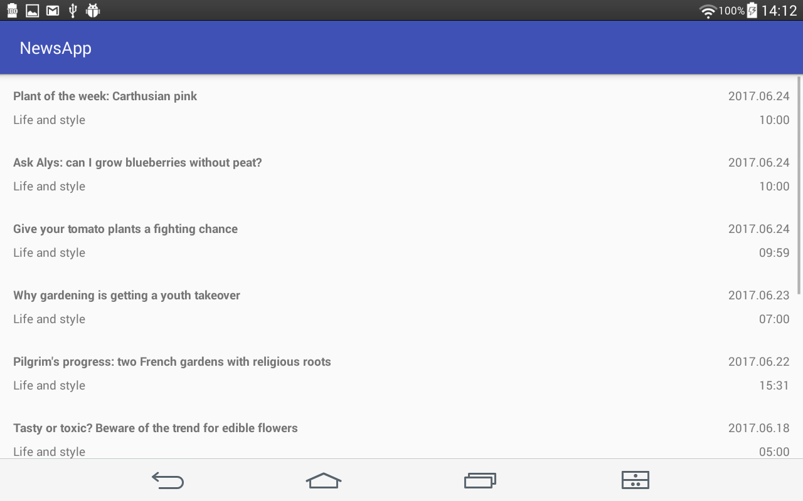
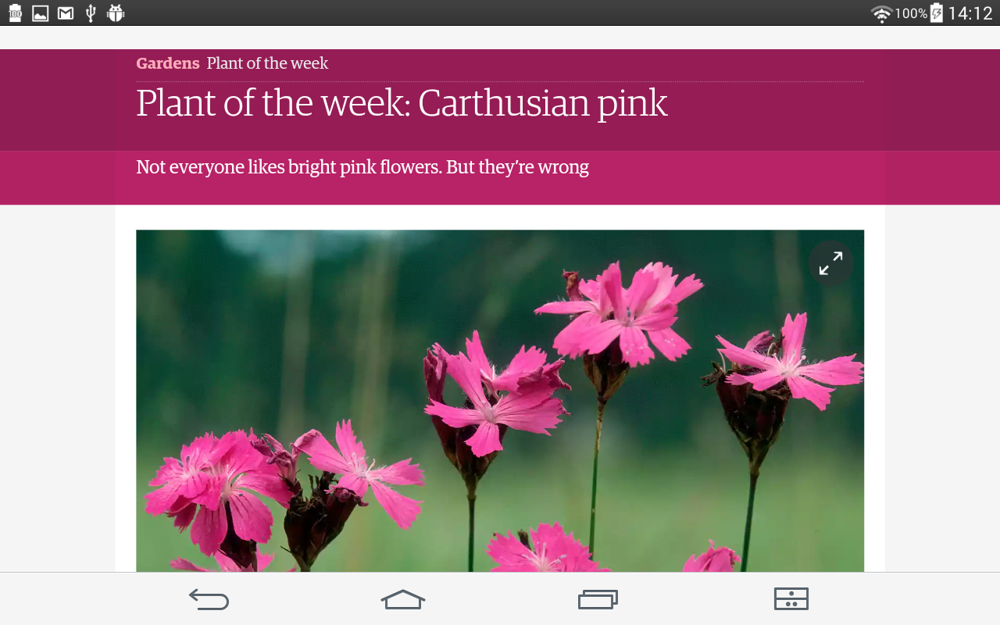

# News App

Sixth task from Udacity's [Android basics course](https://www.udacity.com/course/android-basics-nanodegree-by-google--nd803)

Android Basics: Networking

[Lesson 6: News App](https://review.udacity.com/#!/rubrics/165/view)

This app fetches data from [theguardian](https://www.theguardian.com/international).

App contains a main screen which displays multiple news stories

Each list item on the main screen displays relevant text and information about the story:

- the title of the article
- the name of the section that it belongs to
- author name
- date published

Clicking on a story opens the story in the user’s browser.

App queries the content.guardianapis.com api to fetch news stories related to the topic "", using the ‘test’ api key.

Networking operations are done using Loader.
